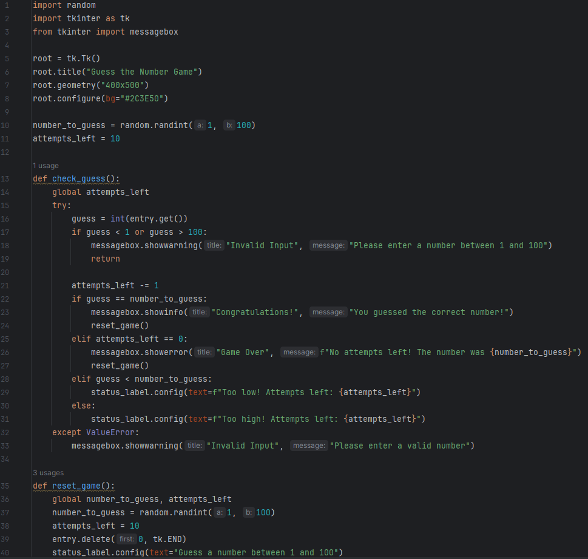
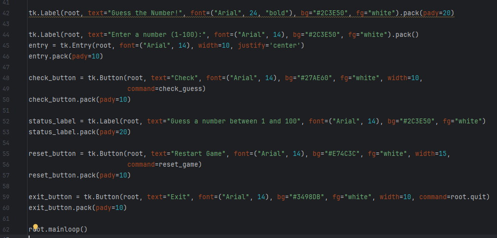
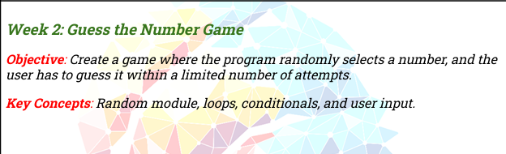
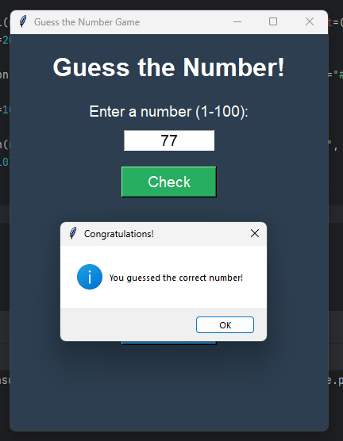
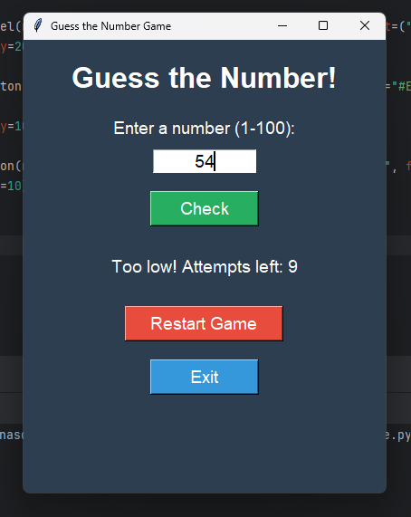
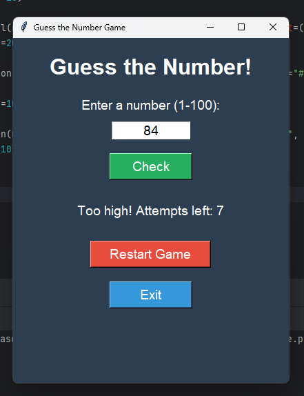

# 🎲 Guess Number Game — Python Desktop GUI Game

> An interactive number guessing game built with Python and Tkinter. Players have 10 attempts to guess a randomly generated number between 1 and 100, with real-time "Too High / Too Low" feedback on every try.

🎬 **Watch the Demo Video — Guess Number Game:** [Google Drive Demo Video](https://drive.google.com/file/d/1HLAhbwVuiRIGd54DSBC3oVLnoK38Uthu/view?usp=drive_link)

[](https://www.python.org/)
[](https://docs.python.org/3/library/tkinter.html)
[](LICENSE)

---

## 🌟 Overview

The **Guess Number Game** is a fun, Tkinter-based graphical desktop game developed as part of a structured Python learning curriculum at **BiStartX**. A random integer between **1 and 100** is secretly chosen at the start of each session. The player has exactly **10 attempts** to guess the correct number. After each wrong guess, the game provides directional feedback — *"Too low!"* or *"Too high!"* — along with the remaining attempt count. Running out of guesses or finding the answer triggers an appropriate message dialog, then automatically resets for a new round.

This project was built to practice and reinforce core Python programming concepts including:
- Conditional logic (`if / elif / else`)
- Global state management with functions
- Random number generation
- Loops and iteration boundaries
- GUI event-driven programming with Tkinter

---

## 📸 Screenshots

### Main Game Window
<p align="center">
  
</p>

### Gameplay — Directional Hints
<p align="center">
   &nbsp;&nbsp;
  
</p>

### Game Outcomes — Win & Lose
<p align="center">
   &nbsp;&nbsp;
  
</p>

### Input Validation
<p align="center">
  
</p>

---

## ✨ Features

- **🎯 Random Number Generation**: Uses Python's `random.randint(1, 100)` to generate a unique secret number at the start of every game session.
- **🔟 10 Attempt Limit**: Players have exactly 10 chances to find the correct number before the game ends.
- **📡 Real-Time Directional Feedback**: After each wrong guess, the status label updates dynamically:
  - *"Too low! Attempts left: X"* — The secret number is higher.
  - *"Too high! Attempts left: X"* — The secret number is lower.
- **🏆 Win Detection**: Instantly shows a **"Congratulations!"** dialog when the player guesses correctly.
- **💀 Game Over Detection**: Shows a **"Game Over"** dialog revealing the secret number when all 10 attempts are exhausted.
- **🔄 Auto-Reset**: After any win or loss, `reset_game()` automatically generates a new number and resets the attempt counter and status label — no need to restart the app.
- **🛡️ Input Validation**: Catches and handles:
  - Non-numeric input → *"Please enter a valid number"* warning.
  - Out-of-range numbers (< 1 or > 100) → *"Please enter a number between 1 and 100"* warning.
- **🖤 Dark-Themed UI**: Custom dark slate blue background (`#2C3E50`) with color-coded buttons:
  - 🟢 **Check** button — Green (`#27AE60`)
  - 🔴 **Restart Game** button — Red (`#E74C3C`)
  - 🔵 **Exit** button — Blue (`#3498DB`)

---

## 🛠️ Tech Stack

| Component | Technology |
| :--- | :--- |
| **Language** | Python 3.8+ |
| **GUI Framework** | `tkinter` (Python Standard Library) |
| **Random Generation** | `random.randint()` |
| **Error Dialogs** | `tkinter.messagebox` |
| **IDE** | PyCharm |

---

## 📁 Project Structure

```
Guess-Number-Game/
│
├── GuessNumberGame.py     # Main game file — GUI layout, game logic, reset
├── 2222.docx              # Project documentation with screenshots & activity log
├── screenshots/
│   ├── screenshot_1.png   # Main game window (fresh start)
│   ├── screenshot_2.png   # "Too Low" feedback after a guess
│   ├── screenshot_3.png   # "Too High" feedback after a guess
│   ├── screenshot_4.png   # "Congratulations!" win dialog
│   ├── screenshot_5.png   # "Game Over" lose dialog with answer revealed
│   └── screenshot_6.png   # Invalid input warning dialog
└── README.md
```

---

## ⚙️ How It Works

```
Game starts → random.randint(1, 100) picks secret number
                         ↓
Player types a guess → clicks [Check]
                         ↓
         check_guess() evaluates the input:
         ┌─────────────────────────────────────────┐
         │ Non-numeric or out of range?            │
         │   → showwarning dialog, no attempt lost │
         │                                         │
         │ Correct guess?                          │
         │   → showinfo "Congratulations!" dialog  │
         │   → reset_game() called automatically   │
         │                                         │
         │ Attempts reached 0?                     │
         │   → showerror "Game Over" dialog        │
         │   → reset_game() called automatically   │
         │                                         │
         │ Too low / Too high?                     │
         │   → status_label updated with hint      │
         │   → attempts_left decremented           │
         └─────────────────────────────────────────┘
                         ↓
         Player clicks [Restart Game] → reset_game()
         Player clicks [Exit]         → root.quit()
```

---

## 🚀 Getting Started

### Prerequisites
- **Python 3.8** or higher (Tkinter is bundled with standard Python — no extra install needed)

### Run the Game

**1. Clone the Repository:**
```bash
git clone https://github.com/AnasQ2003/Guess-Number-Game.git
cd Guess-Number-Game
```

**2. Launch the Game:**
```bash
python GuessNumberGame.py
```

The game window opens immediately. Type any number between 1 and 100 and click **Check** to start playing!

---

## 💡 Key Concepts Demonstrated

| Concept | How It's Used |
| :--- | :--- |
| **Random Module** | `random.randint(1, 100)` generates the secret number |
| **Global Variables** | `global number_to_guess, attempts_left` tracks game state across function calls |
| **Conditional Logic** | `if/elif/else` chain routes each guess to the correct outcome |
| **Exception Handling** | `try/except ValueError` catches non-numeric input gracefully |
| **Range Validation** | `if guess < 1 or guess > 100` enforces the valid guess boundary |
| **State Reset** | `reset_game()` fully reinitializes state without restarting the process |
| **GUI Event Binding** | `command=` parameter wires buttons to Python functions |
| **Dynamic Labels** | `status_label.config(text=...)` updates the hint in real-time |

---

## 🧠 Learning Objectives (BiStartX Week 2)

> ✅ **Objective**: Understand how Python handles decision-making and repetition — teaching the computer to "think" and "repeat" actions based on conditions.

**Activities Completed:**
- ✔️ Studied and practiced `if`, `elif`, and `else` conditional statements.
- ✔️ Built decision-based programs that respond differently based on user input.
- ✔️ Practiced `for` and `while` loops for repeated code execution.
- ✔️ Learned how counters and loop boundaries work to control iteration.
- ✔️ Applied all concepts in a fully functional interactive game.

**Key Takeaways:**
- Logic structuring using conditions is essential for writing responsive programs.
- Loops are powerful tools that eliminate redundancy and automate repetitive tasks.
- Proper Python indentation is not just style — it's functionally critical.
- Global state management across functions requires careful use of the `global` keyword.

---

## 📄 License

This project is open-source and available under the [MIT License](LICENSE).

---

## 👨‍💻 Author

**Anas Ahmed Qureshi** — [@AnasQ2003](https://github.com/AnasQ2003)
*BiStartX Python Internship — Month 01, Week 02*

---

<div align="center">
  <p>Built with ❤️ using <strong>Python & Tkinter</strong></p>

  **⭐ If you found this project helpful, please star the repository!**
</div>
